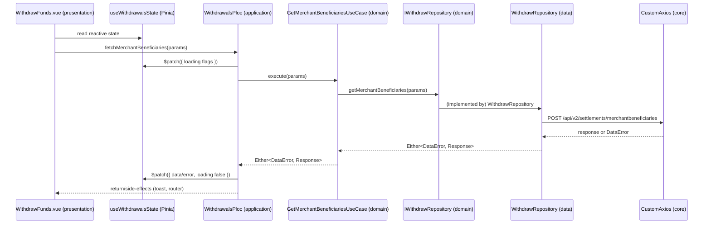

# Request lifecycle (end-to-end flow)

This document explains the “golden path” for a typical feature request in this repo, using Withdrawals as the concrete example.

## The golden path

```text
presentation (Vue SFC)
  → application (Ploc + Pinia store)
    → domain (UseCase + repository interface)
      → data (repository implementation)
        → core (CustomAxios HTTP client)
          → network
```

## Sequence (Withdrawals example)

For example, `WithdrawFunds.vue` fetches beneficiaries and initiates a withdrawal:

1. **Vue view creates/uses state**
   - `const withdrawalsState = useWithdrawalsState()`
2. **Vue view obtains the Ploc**
   - `const ploc = dependencyLocator.provideWidthdrawalPloc()`
3. **View calls Ploc method**
   - `ploc.fetchMerchantBeneficiaries({ merchantUserId })`
4. **Ploc calls a use-case**
   - `this.getMerchantBeneficiariesUseCase.execute(params)`
5. **Use-case calls repository interface**
   - depends on `IWithdrawRepository`
6. **Data repository implementation makes the HTTP call**
   - `WithdrawRepository.getMerchantBeneficiaries(...)` calls `CustomAxios.post(...)`
7. **Result flows back as `Either`**
   - success: `Either.right(...)`
   - error: `Either.left(DataError)`
8. **Ploc handles with `fold`**
   - patches Pinia store (`store.$patch(...)`)
   - shows toast / navigates when appropriate

## Mermaid diagram



## High-level flowchart (layer-level lifecycle)

```graph TD
  A[Presentation<br/>WithdrawFunds.vue] --> B[Application<br/>WithdrawalsPloc<br/>+ useWithdrawalsState]
  B --> C[Domain<br/>GetMerchantBeneficiariesUseCase<br/>+ IWithdrawRepository]
  C --> D[Data<br/>WithdrawRepository]
  D --> E[Core<br/>CustomAxios<br/>Either&lt;DataError, T&gt;]
  E --> F[Network<br/>/api/v2/settlements/merchantbeneficiaries]

  B -- calls execute(params) --> C
  C -- depends on --> D
  D -- POST --> E
  E -- HTTP request --> F
```

## Why `Either` matters here

Instead of throwing exceptions everywhere or relying on ad-hoc `try/catch`, we standardize the “two outcomes” of a remote call:

- **Left**: `DataError` (typed, structured)
- **Right**: success value

Callers handle both explicitly using `fold(leftFn, rightFn)`.

Key files:

- `src/core/domain/Either.ts`
- `src/core/domain/DataError.ts`

## Where dependency injection happens

All wiring lives in:

- `src/core/di/DependencyLocator.ts`

This file constructs:

- `CustomAxios`
- data layer repositories (`*Repository`)
- domain use-cases (`*UseCase`)
- application Plocs (`*Ploc`)

It also keeps a lazy reference to `AuthPloc` so `CustomAxios` can fetch tokens without introducing circular imports.

Next: see [`05-BLoC-and-PloC.md`](./05-BLoC-and-PloC.md) for how our Ploc pattern relates to BLoC (Flutter) and why we chose it.
